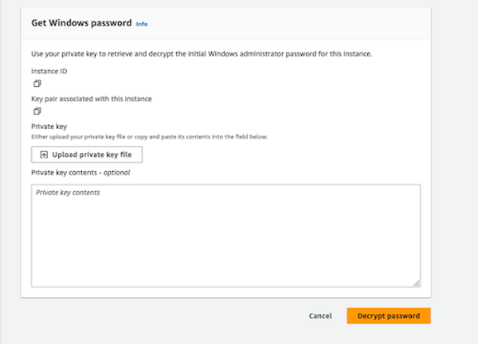
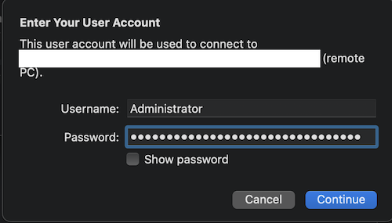
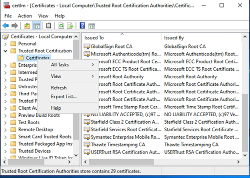
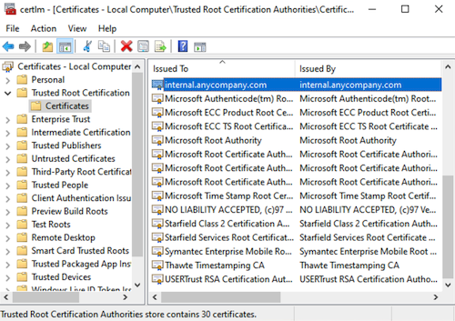
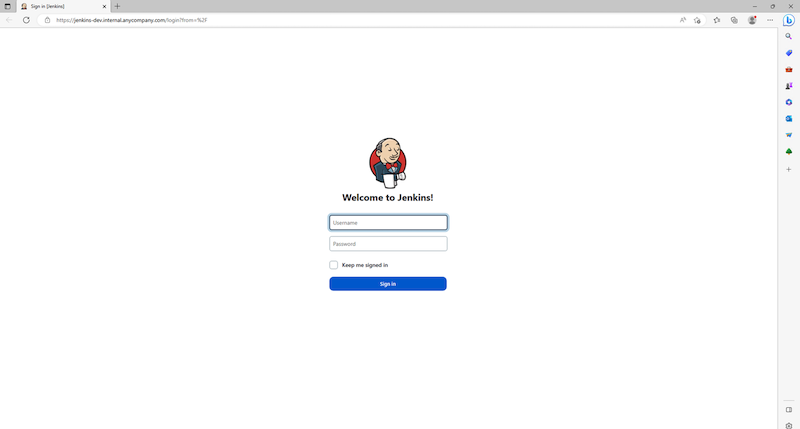

## Bastion Host Setup for Jenkins Access

Ensure that you have access completed the Cloud9 setup and have successfully completed step 8 (from README) prior to working through the below steps. Bastion host will be used to access Jenkins application from trusted network and/or IP space. **Please ensure that the AllowedIP restricts to the IP and/or CIDR for Jenkins Admins.**

## Bastion Host Setup steps

**Note:** Below instructions provide steps to complete the setup using AWS CLI. You can also use AWS Console to deploy the CloudFormation Stack.

1. Create a keypair. Keypair will be used to decrypt the password for the Bastion Host once it is setup.
    - Create a keypair.
        ```bash
        cd ~/environment && mkdir bastion-host-setup && cd bastion-host-setup
        aws ec2 create-key-pair --key-name jenkins-bastion-host-kp --query 'KeyMaterial' --output text > jenkins-bastion-host-kp.pem --region $CDK_DEFAULT_REGION
        ```
    - Download the keypair to your client machine from Cloud9 and delete the jenkins-bastion-host-kp.pem.
        ```bash
        rm jenkins-bastion-host-kp.pem
        ```
 
2. Get the Jenkins VPC ID and Public Subnet ID and VPC CIDR.
    ```bash
    JENKINS_VPC_ID=$(aws ec2 describe-vpcs --filters Name=tag:aws:cloudformation:stack-name,Values=jenkins-iac-dev-deploy-app --query "Vpcs[].VpcId" --region $CDK_DEFAULT_REGION | jq --raw-output '.[]')
    JENKINS_VPC_PUBLIC_SUBNET_ID=$(aws ec2 describe-subnets --filters Name=tag:aws-cdk:subnet-name,Values=public --region $CDK_DEFAULT_REGION --query "Subnets[].SubnetId" | jq --raw-output '.[1]')
    JENKINS_VPC_CIDR=$(aws ec2 describe-vpcs --filters Name=tag:aws:cloudformation:stack-name,Values=jenkins-iac-dev-deploy-app --region $CDK_DEFAULT_REGION --query "Vpcs[].CidrBlock" | jq --raw-output '.[]')
    ```
3. Set the variables for keypair name and identify the IP that you want to access Jenkins from. If you are connected through VPN and/or Direct Connect you can provide the CIDR range else you can provide the host /32 CIDR that you want to connect from.
    ```bash
    BASTION_HOST_KP='jenkins-bastion-host-kp'
    BASTION_HOST_ALLOWED_IP='PROVIDE THE CIDR FOR ALLOWED IP'
    ```

3. Deploy the Bastion Host to the public subnet.

    - Deploy the CloudFormation stack for the Windows Bastion Host.
        ```bash
        aws cloudformation create-stack --stack-name jenkins-bastion-host-stack \
        --template-body file://$HOME/environment/aws-jenkins-ecs-cdk/assets/templates/cfn-windows-bastion-host.yaml \
        --parameters ParameterKey=JenkinsVPCId,ParameterValue=${JENKINS_VPC_ID} ParameterKey=JenkinsPublicSubnetId,ParameterValue=${JENKINS_VPC_PUBLIC_SUBNET_ID} ParameterKey=JenkinsVPCCidr,ParameterValue=${JENKINS_VPC_CIDR} ParameterKey=KeyName,ParameterValue=${BASTION_HOST_KP} ParameterKey=AllowedIP,ParameterValue=${BASTION_HOST_ALLOWED_IP} --capabilities CAPABILITY_NAMED_IAM --region=$CDK_DEFAULT_REGION
        ```
        

    - The above command will output a StackId. To see if the stack is completed successfully, run the below command. This will exit once stack is completed. Please note this will take aproximately 5 to 10 mins.
        ```bash
        aws cloudformation wait stack-create-complete --stack-name jenkins-bastion-host-stack
        ```

## Connecting to Bastion Host.

1. Getting the password.
    - Navigate to AWS Console and click **connect**.

        

    - Click on **RDP Client** tab.
    
        

    - Click on Get Password.
    
        

    - Upload **jenkins-bastion-host-kp.pem** file to decrypt the password.
    
        

    - Click on **Decrypt Password**
    
        

    - Note the decrypted password.

2. Connecting to the bastion host using RDP client.
    - Click on new connection.

    - Add a new PC and provide the Public IP of the Bastion Host.
        
        

    - Enter Username (Administrator) and Password (from step 1 above) and hit connect.


3. Import Root CA into Windows Trusted Root Certification Authorities.

    - Once logged in to Windows, copy the rootCA.crt to your Bastion Host desktop.

    - Open up cert manager and click on Trusted Root Certification on the explorer. 
        
        

    - Right click on All Tasks and Import Task and import the private-root-ca.cer from your desktop.
        
        

4. Validate the Private Root CA Import.
    - Open up EDGE browser.

    - Navigate to `https://jenkins-dev.internal.anycompany.com` and you should see no certificate warnings.

        